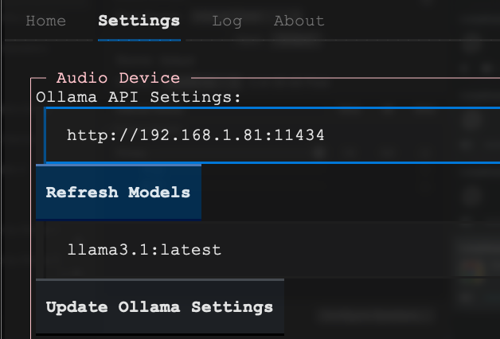
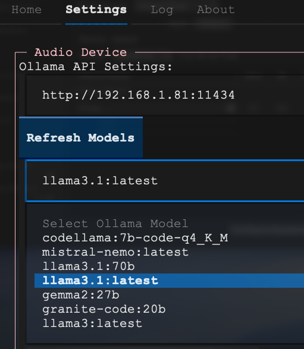
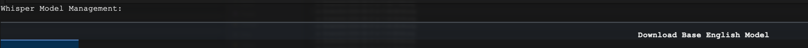
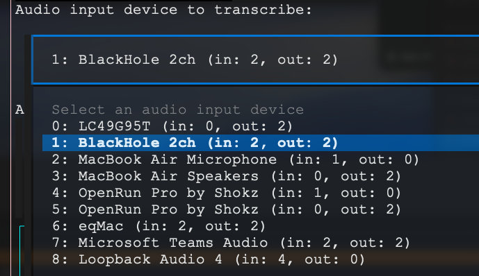
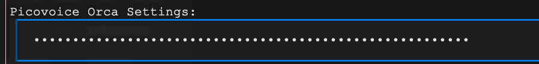
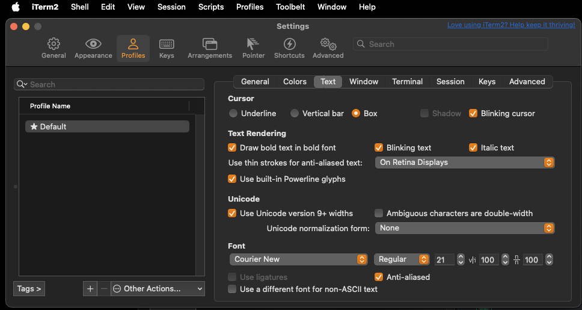
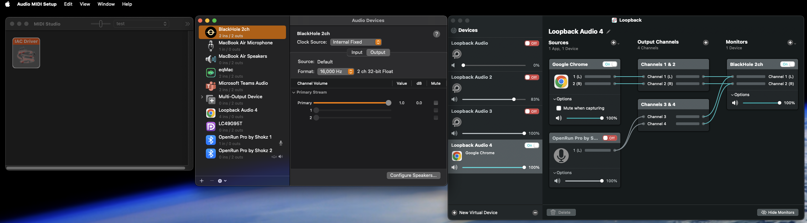

# Terminal based application: Co-Pilot AI Agent using Offline Real-Time Audio Transcription and Offline LLM-Powered Analysis
## includes experimental text-to-speech LLM Response audio feedback

## Overview

This application provides real-time audio transcription and analysis using Large Language Models (LLMs). It captures audio input, transcribes it, and processes the transcription through an LLM to generate intelligent responses. The system is designed for various use cases, including interview assistance, coding help, and general question-answering.  Customizable prompt templates allow for testing multiple audio driven agent use cases such as co-piloting with an audio feed, direct multi-modal human voice interaction, etc.  

## Features

- Real-time audio transcription using either Whisper or Vosk
- Integration with Ollama API for LLM-powered responses
- Customizable prompts for different types of interactions (e.g., interviews, summaries, helpful assistance, conversation analysis, sentiment analysis, puzzle solving, design architecting, code ideation, business strategy recommender)
- Dynamic audio visualization with level monitoring
- Session management for keeping track of multiple conversations (not functional yet)
- User-friendly GUI built with Textual run in the command-line terminal
- Adjustable audio settings including device selection and gain control
- Copy-to-clipboard functionality for easy sharing of transcriptions and LLM responses
- Experimental Text to Speech (TTS) for reading the LLM responses out loud
- Hot keys to quickly copy-to clipboard and start/stop the TTS

[](https://youtu.be/X29zS82GMVk?hd=1 "Demo")

## Prerequisites

- Python 3.7+
- Ollama (for local LLM integration)


- Headset/microphone
- Software audio loopback for mixing microphone and other audio source such as from a browser or video conferencing tool 
  

## Installation

> **_OPTIONAL:_** It is recommended to utilize a Python version management system, such as Miniconda for this step:  
> - To create an environment, use: **_conda create -n py310-audio-ai python=3.10 -y_**
> - To activate the environment, use: **_conda activate py310-audio-ai_**

1. Install by typing:
   ```
   pip install lemonpepper
   ```

2. Install required dependencies:
*  Download and setup Ollama (https://ollama.com/) with your desired LLM (https://ollama.com/library) and ensure it's running on the specified host (default: http://localhost:11434)


## Usage

Run the application:

```
lemonpepper
```

### Settings tab - Set Ollama server location and LLM model
1. Click on the settings tab
2. Point to the ollama server that you have installed already.  The value of the Ollama API Settings form field is preset to http://localhost:11434.  You can change it to another host by editing the form field and changing the localhost to the ip address if you have install ollama to a different machine.
3. If you change the host name, click on the Refresh Models button under the hostname to pull the list of llm models that this ollama server has available.
4. Click on the Select Ollama Model dropdown and it should show an updated list of available models
5. If you do not see any models, then log into your ollama server and make sure to pull a model from their library (https://ollama.com/library).  llama3.1 seems to work well.
6. Choose a model when you can see a selection from the selection menu.
7. Click on Update Ollama Settings.





### Settings tab - Download and Select Whisper model for transcription
1. Download a whisper model by clicking Download Base English Model button.  You should see a download progress bar.  Once completed, it will download the whisper transcription model locally.  It downloads from https://huggingface.co/ggerganov/whisper.cpp/tree/main
2. Choose the transcription method.  We prefer OpenAI Whisper base.en.



### Settings tab - Select audio device for transcription
1. Select an audio input device from the available options.  We prefer BlackHole 2ch after installing BlackHole and mac Loopback and mixing audio from the browser+microphone into the BlackHole 2ch.



### Settings tab - Choose prompt template
1. Select a prompt template based on your use case.


### Home tab
1. Click on the Home tab
2. Start speaking or playing audio from a browser, and the application will transcribe your audio in real-time.
3. The LLM will process the transcription and provide responses.
4. Use the various buttons to control the application, including pausing/resuming transcription, clearing data, and copying responses.
5. Check the Log tab if there is something wrong and need to debug

### Optional - Settings tab - Enter Picovoice Orca to enable text to speech for reading LLM output out loud
1.  Go to https://picovoice.ai/platform/orca/
2.  Create a free account and generate an AccessKey.  It has a limit of 10M characters but that should be enough.  This will require an internet connection for local usage as they verify the access key that way.  This functionality is experimental for now.  If it becomes a blocker, we will choose another TTS engine that does not have these constraints.
3.  Paste the AccessKey into the input field in the settings tab and click Save Settings



### Optional - For a better terminal user experience, turn on Powerline glyphs
1.  On Mac iTerm2, go to Settings > Profiles > Check the box for "Use built-in Powerline glyphs".  This will enable fonts for the footer powerline similar to neovim airline theme.


### Optional - Audio Mixing
1. Advanced users who want to mix audio coming from multiple sources should use tools like built-in Mac MIDI Studio, free Existential Audio's BlackHole (https://github.com/ExistentialAudio/BlackHole/wiki/Multi-Output-Device), pay-for-use Rogue Amoeba's Loopback (https://rogueamoeba.com/loopback/), etc.  On Windows, Jack Audio Connection Kit, VB Audio, etc.  Ubuntu users might use PulseAudio, etc.

Example showing audio from bluetooth headset mic combined with audio from chrome browser (playing youtube video) merged into blackhole 2 channel that outputs at 16Khz.  Note that the whisper transcriber uses 16Khz.


Note that when TTS is used, it is going to the default audio device.  In this case, it was the bluetooth headset.

## Key Components

- `gui_textual.py`: Main application GUI and control logic
- `ollama_api.py`: Integration with Ollama for LLM processing
- `transcribe_audio_whisper.py`: Whisper-based audio transcription
- `transcribe_audio.py`: Vosk-based audio transcription
- `PicovoiceOrcaStreamer.py`: Picovoice Orca TTS integration

## Customization

- TODO: Modify prompts in a Prompts Tab to tailor the LLM's responses
- TODO: Adjust audio processing parameters in settings for optimal performance

## Contributing

Contributions are welcome! Please feel free to submit a Pull Request.

## License

Licensed under the Apache License, Version 2.0 (the "License");
you may not use the files in this project except in compliance with the License.
You may obtain a copy of the License at

    http://www.apache.org/licenses/LICENSE-2.0

Unless required by applicable law or agreed to in writing, software
distributed under the License is distributed on an "AS IS" BASIS,
WITHOUT WARRANTIES OR CONDITIONS OF ANY KIND, either express or implied.
See the License for the specific language governing permissions and
limitations under the License.


## Acknowledgements

- Vosk for offline speech recognition
- Ollama for local LLM integration
- Textual for the TUI framework
- [pywhispercpp](https://github.com/abdeladim-s/pywhispercpp) for python bindings to whisper.cpp
- [Whisper.cpp](https://github.com/ggerganov/whisper.cpp) for c++ port of OpenAI's Whisper model
- OpenAI for their Whisper model
- Meta's Llama 3.1 8B robust LLM model
- Picovoice Orca TTS Beta 
---
